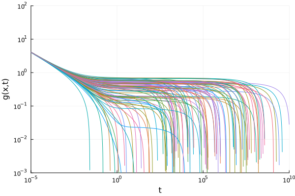

## Beta-scaling equation

The beta-scaling model is implemented to make it easier to find critical exponents of MCT. The equation is

$$\sigma - \delta t + \lambda (g(t))^2 = \partial_t∫g(t-\tau)g(\tau)d\tau.$$

Here, $\sigma$ is the distance from the critical point, $\lambda$ is the relevant eigenvalue of the stability matrix. $g(t)$ describes the deviation of the order parameter from the plateau. $\delta$ is an optional hopping parameter, defaulting to 0 if not specified. Each of the parameters have to be floating point numbers.  


### Example
In order to solve the beta-scaling equation, we have to specify the parameters defining the equation and a time-scale `t0` that shifts the results. 
```julia
using ModeCouplingTheory
using MCTBetaScaling, Plots
λ = 0.7; ϵ = -0.1; t0 = 0.001
equation = BetaScalingEquation(λ, ϵ, t0)
sol = solve(equation, TimeDoublingSolver(t_max=10^4.))
plot(log10.(sol.t), log10.(abs.(sol.F)), ylabel="log_{10}(|g(t)|)", xlabel="log_{10}(t)", label="g(t)")
```


In the figure, the slopes of the straight lines are given by the parameters $-a$ and $b$, which describe the relaxation towards and away from the plateau value of the correlator. These exponents are automatically computed, and are stored in `equation.coeff.a` and `equation.coeff.b`.

## References
Götze, J Phys Condens Matter 2, 8485 (1990)


## Stochastic Beta-Relaxation (SBR)

SBR is an extension of the beta-scaling equation, where the parameter $\sigma$ becomes quenched disorder, and a diffusive term is added
$$\sigma(x) + \alpha \nabla^2 g(x,t) - \delta t + \lambda (g(x,t))^2 = \partial_t \int g(x,t-\tau)g(x,\tau)d\tau$$

This is implemented in 1, 2, and 3 dimensions with periodic boundaries. Example:

```julia
using ModeCouplingTheory, MCTBetaScaling, Plots, Random
L_sys = 100.0 ## physical size of the system
n = 100 ## number of sites on one side of the lattice
dims = 2 
Ls = ntuple(i -> L_sys,  dims)  # Lattice size in each dimension
ns = ntuple(i -> n, dims)  # Number of sites in each dimension of the lattice
Random.seed!(52342)
λ = 0.75
α = 0.1
t₀ = 0.001
σ0 = 0.05 # target σ
delta_σ2 = 0.1  # desired variance
dx = L_sys/n

# small random variations near σ = 0. 
# We divide by dx^2 to get the proper discretization of the delta function
σ_vec = [σ0 + delta_σ2/dx^2*randn() for i in 1:prod(ns)]  

eqn_sys = MCTBetaScaling.StochasticBetaScalingEquation(λ, α, σ_vec, t₀, Ls, ns)
solver = TimeDoublingSolver(t_max=10^10., verbose=true, tolerance=1e-10, N=16, Δt=1e-5)
sol = solve(eqn_sys, solver)

p = plot(xlabel="t", xscale=:log10, yscale=:log10, ylabel="g(x,t)", xlims=(10^-5, 10^10), ylims=(10^-3, 10^2))
for i in 1:100:length(σ_vec) # plot 100 out of the 10000 curves
    plot!(p, sol.t[2:end], abs.(get_F(sol, 2:length(sol.t), i)), label=nothing)
end
display(p)
```



We can make a heatmap for different values of `t` to show the progression of the beta-relaxation.

```julia
t = get_t(sol)
Nt = length(t)
F = F = get_F(sol, :, :) |> stack; # gives a matrix of n^3 x Nt
F = reshape(F, (n,n,Nt)); # array of (n,n,Nt)

ps = []
for ti = 10.0 .^ (-1:10)
    it = findfirst(x -> x>ti, t)
    p_i = heatmap(clamp.(-F[:, :, it], -1, 1), colorbar=false, title="t = $ti")
    push!(ps, p_i)
end
plot(ps..., size=(1000,1000))
```

